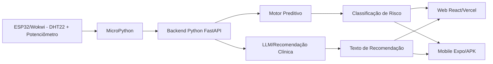

# CardioIA - Fase Final

Plataforma integrada para monitoramento cardíaco com Web React+Vite, Mobile React Native+Expo, Backend Python/FastAPI e IoT em MicroPython no ESP32/Wokwi.

## Links da entrega

Preencha após publicar:

- URL pública Vercel: `INSERIR_URL_DA_VERCEL`
- Link do APK no Expo/EAS: `INSERIR_LINK_DO_BUILD`
- Link Wokwi MicroPython: `INSERIR_LINK_WOKWI`
- Vídeo demonstrativo/prints: `INSERIR_LINK_DRIVE_OU_GITHUB`

## Estrutura do projeto

```text
web/       Front-end React + Vite preparado para Vercel
mobile/    App Expo preparado para build APK por EAS
backend/   Serviço Python/FastAPI integrador dos sinais e IA
iot/       Script MicroPython + arquivos Wokwi
/docs      Relatório técnico e arquitetura final
```

## PARTE 1 - Deploy e distribuição profissional

### 1. Repositório GitHub privado

```bash
git init
git add .
git commit -m "fase final cardioia"
git branch -M main
git remote add origin https://github.com/SEU_USUARIO/cardioia-fase-final.git
git push -u origin main
```

Depois, em **Settings > Collaborators**, compartilhe o repositório privado com o tutor.

### 2. Web na Vercel

A pasta `web/` contém o arquivo obrigatório `vercel.json` para rotas SPA:

```json
{
  "rewrites": [
    { "source": "/(.*)", "destination": "/index.html" }
  ]
}
```

Passos:

```bash
cd web
npm install
npm run build
```

Na Vercel:

1. New Project.
2. Importar o repositório GitHub.
3. Root Directory: `web`.
4. Framework: Vite.
5. Build Command: `npm run build`.
6. Output Directory: `dist`.
7. Adicionar variável opcional `VITE_API_URL=https://URL_DO_BACKEND`.
8. Deploy.

A Vercel ativa CI/CD automaticamente: cada `git push` na branch principal gera um novo deploy.

### 3. Mobile APK via Expo/EAS

A pasta `mobile/` contém:

- `app.json` com `android.package`: `br.com.cardioia.app`
- `eas.json` com perfil `preview` gerando APK

Comandos:

```bash
cd mobile
npm install
npx eas login
npx eas build:configure
npx eas build -p android --profile preview
```

Ao final, copie o link do build do dashboard Expo/EAS para este README. Instale o `.apk` em um Android real e valide o login e a tela de indicadores cardíacos.

## PARTE 2 - Integração do ecossistema

### Backend integrador Python

```bash
cd backend
python -m venv .venv
# Windows:
.venv\Scripts\activate
# Linux/Mac:
# source .venv/bin/activate
pip install -r requirements.txt
uvicorn app.main:app --reload
```

Endpoints:

```http
GET /
POST /api/sinais
GET /api/leituras
```

Exemplo de teste:

```bash
curl -X POST http://localhost:8000/api/sinais \
  -H "Content-Type: application/json" \
  -d '{"patient_id":"paciente-demo","temperatura":38.5,"bpm":145,"spo2":91,"origem":"teste"}'
```

### MicroPython / Wokwi

A pasta `iot/` possui:

- `main.py`: captura DHT22, potenciômetro/BPM, classifica risco e envia ao backend.
- `diagram.json`: ESP32 + DHT22 + potenciômetro + LEDs.
- `wokwi.toml`: configuração da simulação.

Para publicar no Wokwi:

1. Criar projeto ESP32 MicroPython.
2. Copiar `iot/main.py`, `iot/diagram.json` e `iot/wokwi.toml`.
3. Trocar `BACKEND_URL` pela URL pública do backend.
4. Executar a simulação.
5. Copiar o link público do projeto Wokwi para este README.

## Validação final

Checklist para evidências/prints:

- [ ] Repositório GitHub privado compartilhado com o tutor.
- [ ] Deploy Web concluído na Vercel.
- [ ] CI/CD comprovado por push no GitHub.
- [ ] Rota SPA `/dashboard` ou refresh funcionando.
- [ ] APK gerado no EAS com perfil `preview`.
- [ ] APK instalado em dispositivo real.
- [ ] Login validado no Web e Mobile.
- [ ] Dashboard exibindo BPM, temperatura, SpO₂, risco e recomendação.
- [ ] Backend recebendo `/api/sinais`.
- [ ] Wokwi MicroPython acionando LEDs conforme risco.

## Arquitetura final


