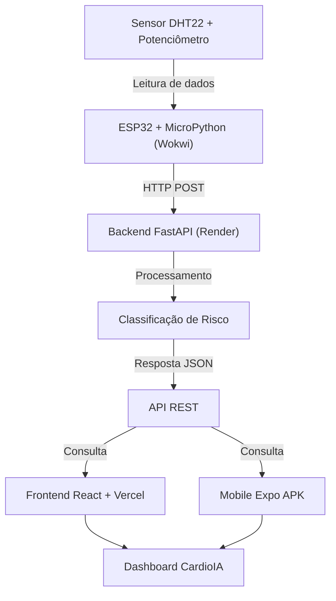

PARTE 1 – Deploy e Distribuição Profissional
Aplicação Web
URL pública da aplicação:
https://cardioia-fase2.vercel.app/
Deploy Automático (CI/CD)
A aplicação Web foi publicada na Vercel integrada ao GitHub. Cada push realizado na branch principal 
Configuração SPA
Arquivo utilizado:
{
  "rewrites": [
    {
      "source": "/(.*)",
      "destination": "/index.html"
    }
  ]
}
________________________________________
Aplicação Mobile
Build APK gerado pelo Expo EAS.
Link do build:
https://expo.dev/accounts/lfonsec/projects/cardioia-mobile/builds/bbc482f9-4b9a-4ede-946b-0ff049e1c6ec________________________________________
Evidências de Deploy
Deploy Web na Vercel
 
Aplicação Web em execução
 Build APK concluído
 
 ________________________________________
Instalação da Aplicação Mobile
1.	Abrir o link do build Expo.
2.	Baixar o arquivo APK.
3.	Transferir para o dispositivo Android.
4.	Habilitar instalação de fontes desconhecidas.
5.	Instalar o APK.
6.	Abrir o aplicativo CardioIA.
________________________________________
PARTE 2 – Integração do Ecossistema e Arquitetura Final
Arquitetura
Frontend Web (React + Vite)
↓
Backend Integrador (Python + FastAPI)
↓
Modelo Preditivo CardioIA
↓
Motor de Recomendações Clínicas
↓
MicroPython ESP32 / Wokwi
________________________________________
Backend Integrador
Localização:
backend/
Tecnologias:
•	Python
•	FastAPI
•	Pydantic
Execução:
cd backend
pip install -r requirements.txt
________________________________________
Simulação IoT
Localização:
iot/main.py
Link público Wokwi:
https://wokwi.com/projects/466473443936318465
O sistema simula:
•	Temperatura corporal (DHT22)
•	Batimentos cardíacos (Potenciometro)
•	Saturação de oxigênio (DHT22, sensor de umidade)
•	Classificação automática de risco
•	Feedback visual por LEDs
________________________________________
 
