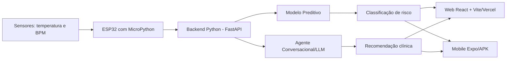

# Relatório Técnico - CardioIA

## 1. Objetivo
A CardioIA é uma plataforma de saúde digital que integra sensores simulados, backend Python, motores de IA e interfaces Web/Mobile para monitoramento de indicadores cardíacos e geração de recomendações em tempo real.

## 2. Arquitetura Final
Fluxo de dados:

Sensor DHT22/Potenciômetro → MicroPython/ESP32 → Backend Python/FastAPI → Motor Preditivo + LLM → Interface Web/Mobile

## 3. Backend Integrador
O backend foi desenvolvido em Python com FastAPI. Ele recebe leituras dos sensores, processa os indicadores e retorna risco baixo, moderado ou alto. O mesmo núcleo pode ser conectado aos modelos preditivos da fase anterior e a APIs de LLM para recomendações em linguagem natural.

## 4. MicroPython e IoT
A lógica de captura antes escrita em C/C++ foi convertida para MicroPython, simulando execução em ESP32 no Wokwi. O sensor DHT22 coleta temperatura e o potenciômetro simula batimentos cardíacos. LEDs indicam visualmente o nível de risco.

## 5. UX e fluxo de informação
A interface prioriza indicadores críticos: BPM, temperatura, SpO2, risco calculado e recomendação. As cores verde, amarelo e vermelho reduzem a carga cognitiva e facilitam interpretação rápida por pacientes ou profissionais de saúde.

## 6. Deploy e distribuição
A aplicação Web foi preparada para Vercel com `vercel.json` para suporte a rotas SPA. O app Mobile foi configurado com Expo/EAS, usando `app.json` com pacote Android em domínio invertido e `eas.json` com perfil `preview` para geração de APK.

## 7. Trabalho em equipe
Sugestão de divisão:
- Integrante 1: Front-end Web e UX.
- Integrante 2: Mobile Expo e APK.
- Integrante 3: Backend Python e IA.
- Integrante 4: IoT/MicroPython/Wokwi.
- Integrante 5: documentação, testes, vídeo e integração final.
